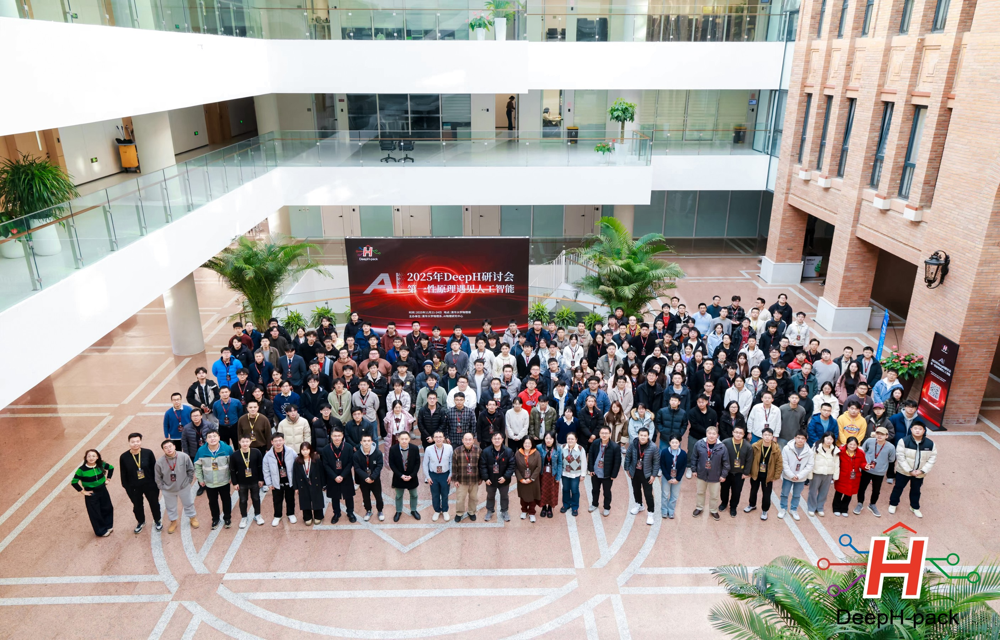

<!-- markdownlint-disable MD033 -->
# Citation & Community

## Citation

If you use `DeepH-pack` in your work, please cite the following publications.

- **The original framework paper introducing the foundational methodology:**

    [He Li, Zun Wang, Nianlong Zou, *et al*. Deep-learning density functional theory Hamiltonian for efficient ab initio electronic-structure calculation. Nat. Comput. Sci. 2, 367 (2022)](https://doi.org/10.1038/s43588-022-00265-6)

- **Complete package featuring the latest implementation, methodology, and workflow:**

    [Yang Li, Yanzhen Wang, Boheng Zhao, *et al*. DeepH-pack: A general-purpose neural network package for deep-learning electronic structure calculations. arXiv:2601.02938 (2026)](https://arxiv.org/abs/2601.02938)

```bibtex
@article{li2022deep,
    title={Deep-learning density functional theory Hamiltonian for efficient ab initio electronic-structure calculation},
    author={Li, He and Wang, Zun and Zou, Nianlong and Ye, Meng and Xu, Runzhang and Gong, Xiaoxun and Duan, Wenhui and Xu, Yong},
    journal={Nat. Comput. Sci.},
    volume={2},
    number={6},
    pages={367},
    year={2022},
    publisher={Nature Publishing Group US New York}
}

@article{li2026deeph,
    title={DeepH-pack: A general-purpose neural network package for deep-learning electronic structure calculations},
    author={Li, Yang and Wang, Yanzhen and Zhao, Boheng and Gong, Xiaoxun and Wang, Yuxiang and Tang, Zechen and Wang, Zixu and Yuan, Zilong and Li, Jialin and Sun, Minghui and Chen, Zezhou and Tao, Honggeng and Wu, Baochun and Yu, Yuhang and Li, He and da Jornada, Felipe H. and Duan, Wenhui and Xu, Yong },
    journal={arXiv preprint arXiv:2601.02938},
    year={2026}
}
```

## Join the Community

### 🎤 DeepH-pack Global User Conference

- **2025 Conference Materials**: [Workshop Tutorials & Case Studies](https://deeph-workshop-tutorial.readthedocs.io)

<div align="center" style="margin: 20px 0;">



**2025 User Conference Successfully Concluded!**  
*Global materials scientists gathered to explore computational frontiers*
</div>

- **Upcoming Events**:  
  <!-- [2026 Conference Announcement Timeline](...) -->
  2026 Conference Announcement Timeline (Coming Soon...)
- **Community Channels**:
  - [GitHub Issue](https://github.com/kYangLi/DeepH-pack-docs/issues)
  <!-- - Slack/Mattermost -->

## Final Notes

DeepH-pack is an ongoing project that continues to evolve with contributions from the materials science and computational physics communities. Your feedback, contributions, and use cases help shape the future development of this toolkit.

Whether you're using DeepH-pack for research, education, or industry applications, we hope it serves as a valuable tool in your computational materials science workflow.

**Happy computing!** 🚀
