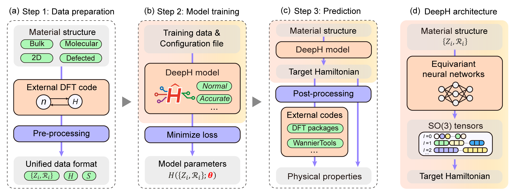

# Theoretical background

## Deep-learning Hamiltonian method (DeepH)

Deep-learning Hamiltonian method, [starting from 2021](https://arxiv.org/abs/2104.03786), is widely recognized as one of the leading methods in deep-learning electronic Hamiltonians. Although designated to model electronic Hamiltonians in solid-state systems (periodic crystals), the new version of DeepH-pack also achieves high accuracy in modeling electronic Hamiltonains (or Fock matrix) in molecular systems. After nearly five years of development, DeepH has seen vast in-depth advancements, which could be roughly characterized into five categories:

1. **Latest Software Implementation**

    - [Yang Li, Yanzhen Wang, Boheng Zhao, *et al*. DeepH-pack: A general-purpose neural network package for deep-learning electronic structure calculations. arXiv:2601.02938 (2026)](https://arxiv.org/abs/2601.02938)

2. **Architecture advancements**

    - **DeepH**: Original framework [Nat. Comput. Sci. 2, 367 (2022)](https://doi.org/10.1038/s43588-022-00265-6)
    - **DeepH-E3**: Integrating equivariant neural network [Nat. Commun. 14, 2848 (2023)](https://doi.org/10.1038/s41467-023-38468-8)
    - **DeepH-2**: Incorporating eSCN tensor product [arXiv:2401.17015 (2024)](https://arxiv.org/abs/2401.17015)
    - **DeepH-Zero**: Leveraging physics-informed unsupervised learning [Phys. Rev. Lett. 133, 076401 (2024)](https://doi.org/10.1103/PhysRevLett.133.076401)

3. **Improved compatibility with first-principles codes**

    - **HPRO**: Compatibility with plane-wave DFT [Nat. Comput. Sci. 4, 752 (2024)](https://doi.org/10.1038/s43588-024-00701-9)
    - **DeepH-hybrid**: Extension to hybrid DFT [Nat. Commun. 15, 8815 (2024)](https://doi.org/10.1038/s41467-024-53028-4)

4. **Exploration of application scenarios**

    - **xDeepH**: Dealing with magnetism with extended DeepH [Nat. Comput. Sci. 3, 321 (2023)](https://doi.org/10.1038/s43588-023-00424-3)
    - **DeepH-DFPT**: Investigating density functional perturbation theory [Phys. Rev. Lett. 132, 096401 (2024)](https://doi.org/10.1103/PhysRevLett.132.096401)
    - **DeepH-UMM**: Developing the universal model for electronic structures [Sci. Bull. 69, 2514 (2024)](https://doi.org/10.1016/j.scib.2024.06.011)

5. **Review of Recent Advancement**

    - From DeepH and ML-QMC to fast, accurate materials computation [Nat. Comput. Sci. 5, 1133 (2025)](https://doi.org/10.1038/s43588-025-00932-4)

It's worth emphasizing that, despite lasting development, DeepH is still in its primary stage, especially in terms of applications. We're currently exploring several exciting DeepH application scenarios, with some of the results may come up lately.

## Deep-learning electronic structures with DeepH

A naive illustration of the DeepH workflow is demonstrated as follows:

[Source: arXiv:2601.02938 [cond-mat.mtrl-sci]](https://arxiv.org/abs/2601.02938)

The core concept is as follows: Instead of modeling electronic structure properties such as band gap, electric conductivity, etc. directly, we use DeepH to model the DFT Hamiltonian. Although the requirement for postprocessing introduces additional burden to the workflow, the advantages of modeling Hamiltonian is apparent, to name a few:

- DFT Hamiltonian includes *complete* electronic structure information at the mean-field level, therefore in principle all mean-field electronic structures could be derived with a single model.
- DFT Hamiltonian contains abundant underlying data, therefore is favorable for data-hungry deep-learning methods.
- Through representation under atomic orbital basis sets, DFT Hamiltonian is compatible to several physical priors inspiring physics-informed design of DeepH.

In terms of physical priors of DFT Hamiltonians, we first emphasize that DeepH models **DFT Hamiltonians under localized atomic orbital (AO) basis sets**. The basis functions can be denoted by:

$$ \phi_{Iplm}(\textbf{r}-\textbf{R}_I)=R_{Ipl}(|\textbf{r}-\textbf{R}_I|)Y_{lm}(\textbf{r}-\textbf{R}_I) $$

Here, the basis centered at atom $I$ is indexed by three other indices, multiplicity index $p$, angular quantum number $l$, and magnetic quantum number $m$. The basis value at $\textbf{r}$ is determined by its relative position to nucleus $\textbf{R}_I$, and is the product of a radial function and a spherical harmonics. Such basis sets are in general non-orthogonal.

Below we introduce abbreviated notation $\alpha\equiv(plm)$. The DFT Hamiltonian matrix elements under localized basis can be formally written as:

$$ H_{I\alpha J\beta}=\langle\phi_{I\alpha}|\hat{H}|\phi_{J\beta}\rangle $$

From this definition, two properties of the Hamiltonian will be apparent:

- Sparsity: since atomic-like basis have a decaying radial part, $H_{I\alpha J\beta}$ vanishes for far-away atom pairs $I,J$
- Equivariance (Covariance): Upon spatial rotation, the radial part of basis functions are unchanged, while the spherical harmonics part transform under a certain rule. Therefore we have a mathematical foundation for understanding how $H_{I\alpha J\beta}$ transforms under spatial rotation, thereby capable of expressing equivariance (covariance).

In addition, since Hamiltonians are expressed under localized bases, from Walter Kohn's "nearsightedness principle", certain matrix elements could be largely decided by the atomic structure in its vicinity, enabling the $O(N)$-scaling prediction with DeepH.

DeepH models are **graph neural networks** (GNNs). They take atomic structures as input and predict physical quantities. The input structures are treated as graphs with atoms as nodes. Any pair of atoms $i$ and $j$ are connected by directed edges $i \rightarrow j$ and $j \rightarrow i$ if they're sufficiently close (i.e., their atomic orbital basis functions overlap). There are also self-loops $i \rightarrow i$ in the graph. Physical quantities, such as Hamiltonian matrix elements, are interpreted as *features* associated with the nodes and edges of the graph.

Although we briefly discuss the physical priors of DFT Hamiltonians under AO basis, realizing it in deep-learning is non-trivial, and we recommend readers refer to the above references for more detailed discussions.
